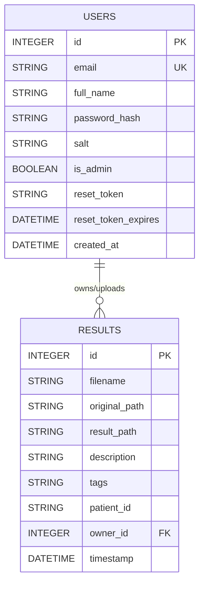

# ER Diagram

```mermaid
erDiagram
    USERS ||--o{ RESULTS : "owns/uploads"

    USERS {
        INTEGER id PK
        STRING email UK
        STRING full_name
        STRING password_hash
        STRING salt
        BOOLEAN is_admin
        STRING reset_token
        DATETIME reset_token_expires
        DATETIME created_at
    }

    RESULTS {
        INTEGER id PK
        STRING filename
        STRING original_path
        STRING result_path
        STRING description
        STRING tags
        STRING patient_id
        INTEGER owner_id FK
        DATETIME timestamp
    }
```

## Notes
- `RESULTS.owner_id` is a foreign key to `USERS.id`.
- `owner_id` is nullable, so a result can exist without an associated user.
- `email` in `USERS` is unique.
